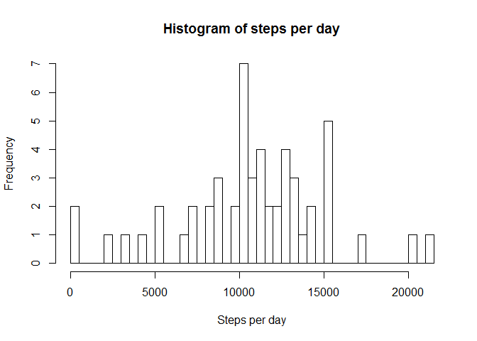
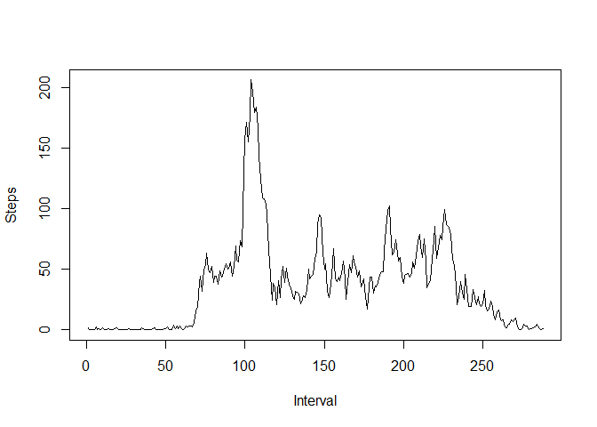
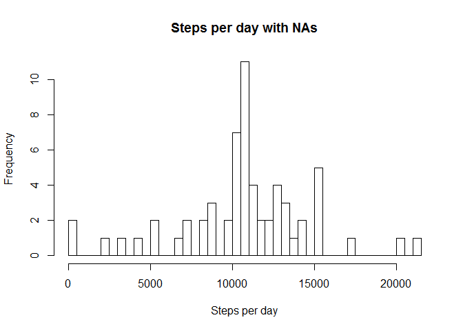
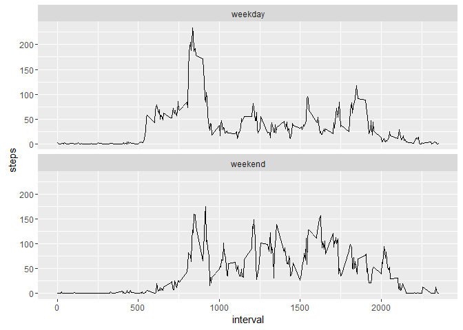

# Reproducible Research: Peer Assessment 1


## Loading and preprocessing the data


```r
#Necessary packages
library(dplyr)
```

```
## 
## Attaching package: 'dplyr'
```

```
## The following objects are masked from 'package:stats':
## 
##     filter, lag
```

```
## The following objects are masked from 'package:base':
## 
##     intersect, setdiff, setequal, union
```

```r
library(lubridate)
```

```
## Warning: package 'lubridate' was built under R version 3.2.3
```

```r
library(ggplot2)
```

```
## Warning: package 'ggplot2' was built under R version 3.2.3
```

```r
# data loading and processing

x <- read.csv(unzip("activity.zip", "activity.csv"))
x$date <- ymd(x$date)
x$steps<- as.numeric(x$steps)
head(x)
```

```
##   steps       date interval
## 1    NA 2012-10-01        0
## 2    NA 2012-10-01        5
## 3    NA 2012-10-01       10
## 4    NA 2012-10-01       15
## 5    NA 2012-10-01       20
## 6    NA 2012-10-01       25
```

## What is mean total number of steps taken per day?

Mean is 10766.19 and median equals 10765

```r
#remove NAs (not strincly necessary though)
x1<-   filter(x, !is.na(steps))
#create df with total number of steps per day
y<-data.frame(tapply(x1$steps, x1$date, sum))
colnames(y) <- c("total")
head(y)
```

```
##            total
## 2012-10-02   126
## 2012-10-03 11352
## 2012-10-04 12116
## 2012-10-05 13294
## 2012-10-06 15420
## 2012-10-07 11015
```

```r
#histogram of steps per day
hist(y$total,61, xlab = "Steps per day", main = "Histogram of steps per day")
```



```r
#mean and median
mean_steps<- mean(y$total, na.rm = TRUE)
median_steps<- (median(y$total, na.rm = TRUE))

print(mean_steps)
```

```
## [1] 10766.19
```

```r
print(median_steps)
```

```
## [1] 10765
```


## What is the average daily activity pattern?

Higher intensity in the earlier intervals.
The 835th interval is the one with the most steps. 


```r
#write your R-code here

x3<- filter(x1, !is.na(steps))
x4<- group_by(x3)
steps_day<- data.frame(tapply(x4$steps, x4$interval, mean))
head(steps_day)
```

```
##    tapply.x4.steps..x4.interval..mean.
## 0                            1.7169811
## 5                            0.3396226
## 10                           0.1320755
## 15                           0.1509434
## 20                           0.0754717
## 25                           2.0943396
```

```r
plot(steps_day$tapply.x4.steps..x4.interval..mean., type = "l", ylab = "Steps", xlab = "Interval")
```



```r
#maximum
print(steps_day[which.max(steps_day$tapply.x4.steps..x4.interval..mean.),])
```

```
##      835 
## 206.1698
```


## Imputing missing values

2304 missing values now filled with the mean from steps_day.
As expected, no difference in mean in comparision with the data set with NAs


```r
#number of NA

sum(is.na(x$steps))
```

```
## [1] 2304
```

```r
x_NA<- is.na(x$steps)
y<- x
y$steps[x_NA]<- steps_day$tapply.x4.steps..x4.interval..mean.
sum(is.na(y))
```

```
## [1] 0
```

```r
head(y)
```

```
##       steps       date interval
## 1 1.7169811 2012-10-01        0
## 2 0.3396226 2012-10-01        5
## 3 0.1320755 2012-10-01       10
## 4 0.1509434 2012-10-01       15
## 5 0.0754717 2012-10-01       20
## 6 2.0943396 2012-10-01       25
```

```r
#histogram, mean, median

y_day<-data.frame(tapply(y$steps, y$date, sum))
hist(y_day$tapply.y.steps..y.date..sum.,61, main = "Steps per day with NAs", xlab = "Steps per day")
```



```r
mean_full<- mean(y_day$tapply.y.steps..y.date..sum.)
median_full<- median(y_day$tapply.y.steps..y.date..sum.)

#no difference in mean
print(mean_full - mean_steps)
```

```
## [1] 0
```


## Are there differences in activity patterns between weekdays and weekends?

More activity earlier in weekdays in comparision to weekends. However, the remaining activity on weekdays seems lower than on weekends.


```r
data<- data.frame(x)
data$date <- weekdays(data$date)

#create weekday variable

data$weekday<- ifelse((data$date == "Saturday" | data$date == "Sunday"), "weekend", "weekday")

data<- filter(data, !is.na(steps))
data_weekday<- filter(data, weekday == "weekday")
data_interval<- data.frame(tapply(data$steps, data$interval, mean))

#group - initially tried with tapply but it is much easier to use group by and summarise here so that we keep the weekday variable

data_interval <- data %>%
  group_by(interval, weekday) %>%
  summarise(steps = mean(steps))

#plot - This step also required some research. A similar chart was built in another module though

ggplot(data_interval, aes(x=interval, y=steps)) + geom_line() + facet_wrap(~weekday, ncol = 1, nrow=2)
```


